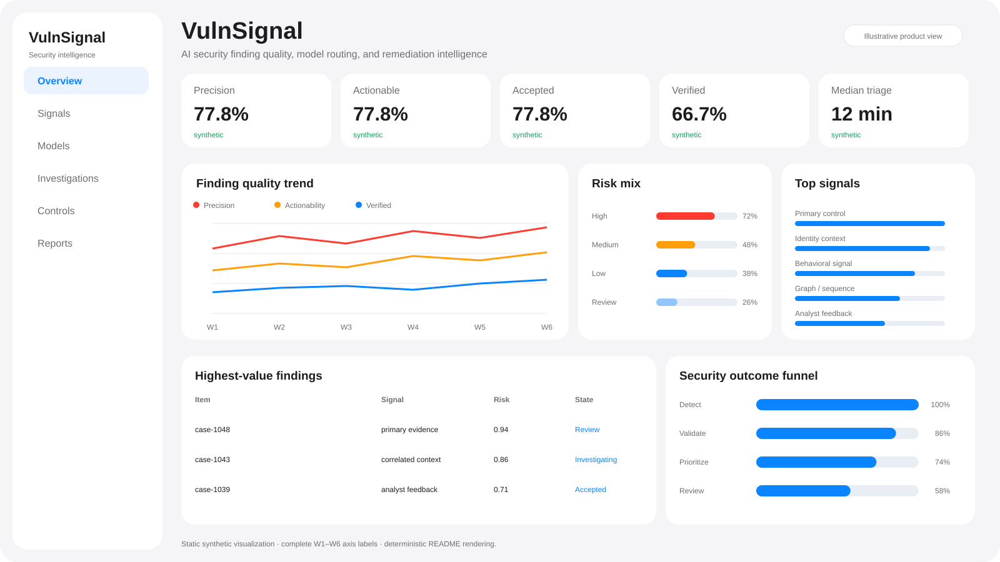
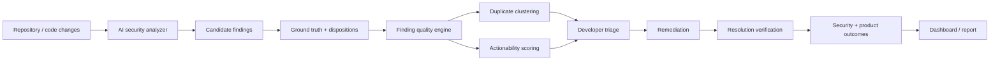

<div align="center">

# VulnSignal

### AI Security Finding Quality · Triage · Remediation Intelligence

**Measure what happens after an AI system says “this looks vulnerable.”**

[](https://www.python.org/)
[](dashboard/app.py)
[](https://github.com/VinayK88/VulnSignal/actions/workflows/ci.yml)
[](#evaluation-boundary)

**Detect → validate → calibrate → deduplicate → triage → remediate → verify**

</div>

---



VulnSignal is a security data-science platform for evaluating AI-generated security findings across the **full security workflow**—not just raw model accuracy.

It answers a harder question:

> **Was the finding correct, appropriately severe, actionable, non-duplicative, accepted by the developer, remediated, and actually verified as resolved?**

## Why this project matters

AI security products can look successful on finding volume while creating downstream costs: duplicate alerts, inflated severity, weak evidence, wasted developer time, and findings that never turn into verified fixes.

VulnSignal treats those downstream outcomes as first-class security and product metrics.

```text
AI finding
   ↓
Is it correct?
   ↓
Is severity calibrated?
   ↓
Is it actionable and unique?
   ↓
Does a developer accept it?
   ↓
Does it get remediated?
   ↓
Is the resolution verified?
```

## Dashboard

The Streamlit dashboard turns the synthetic benchmark into an executive + analyst workflow with four views:

1. **Executive overview** — precision, actionability, acceptance, verified resolution, security-outcome funnel, and highest-value findings.
2. **Finding explorer** — interactive filtering by predicted severity, CWE, and actionability score.
3. **Workflow experiment** — control vs enriched-finding workflow for completion, acceptance, remediation, and triage time.
4. **Quality diagnostics** — recall, severity error, duplicate burden, deduplication reduction, severity mix, and CWE mix.

Run it locally:

```bash
python -m venv .venv
source .venv/bin/activate
pip install -e '.[dashboard]'
streamlit run dashboard/app.py
```

## Architecture



## Measurement framework

VulnSignal deliberately separates four layers that are often collapsed into one model score:

| Layer | Core question | Metrics |
|---|---|---|
| **Model quality** | Did the system identify real vulnerabilities? | Precision, recall |
| **Finding quality** | Is the output useful and correctly prioritized? | Severity MAE, actionability, duplication |
| **Workflow quality** | Can developers act efficiently? | Acceptance, triage completion, triage time |
| **Security outcome** | Did the finding lead to real risk reduction? | Remediation, verified resolution |

## Core metrics

The executable synthetic benchmark reports:

- finding precision and recall;
- severity error in ordinal severity levels;
- actionability rate;
- developer acceptance rate;
- duplicate rate and deduplication reduction;
- remediation rate;
- verified-resolution rate;
- median time to triage;
- median time to remediation;
- treatment-vs-control workflow effects;
- bootstrap uncertainty for remediation-rate improvement.

## Actionability score

VulnSignal includes an inspectable prioritization score:

```text
actionability =
    0.30 × model confidence
  + 0.25 × evidence quality
  + 0.20 × fix quality
  + 0.25 × asset criticality
  - 0.15 × duplicate penalty
```

This is **not** presented as a calibrated vulnerability probability. It is a transparent decision-support score whose assumptions can be challenged and sensitivity-tested.

## Duplicate reduction

The baseline duplicate engine clusters findings using token overlap across CWE, code path, and description. The goal is to quantify a practical security-product question:

> **How much developer triage work disappears when near-duplicate findings are consolidated?**

A production evolution could compare this baseline with embedding retrieval, pairwise duplicate classification, or graph-based root-cause grouping.

## Triage experiment

The synthetic experiment compares:

**Control** — developer receives the raw AI finding.

**Treatment** — developer receives stronger evidence, prioritization context, and remediation guidance.

The analysis measures:

```text
triage completion
finding acceptance
remediation
median triage time
```

and bootstraps the treatment-minus-control remediation difference rather than reporting only a point estimate.

## SQL data foundation

`sql/finding_quality.sql` demonstrates how warehouse data can connect:

```text
finding event
  → model/version metadata
  → code asset / owner
  → validation / disposition
  → duplicate/root-cause cluster
  → remediation change
  → resolution verification
```

That linkage matters because security finding quality cannot be inferred from model output alone.

## Quick start

```bash
python -m venv .venv
source .venv/bin/activate
pip install -e .

vulnsignal
python -m unittest discover -s tests -v
```

Dashboard:

```bash
pip install -e '.[dashboard]'
streamlit run dashboard/app.py
```

## Repository map

```text
VulnSignal/
├── dashboard/
│   └── app.py            interactive executive + analyst dashboard
├── assets/
│   └── dashboard-preview.svg
├── vulnsignal/
│   ├── models.py         finding contract
│   ├── metrics.py        quality + downstream metrics
│   ├── dedupe.py         transparent duplicate clustering
│   ├── experiment.py     workflow comparison + bootstrap
│   ├── fixtures.py       deterministic synthetic benchmark
│   ├── report.py         integrated evidence report
│   └── cli.py
├── sql/
│   └── finding_quality.sql
├── tests/
├── .github/workflows/ci.yml
├── SECURITY.md
└── pyproject.toml
```

## Production evolution

High-value extensions would include:

- versioned adapters for real code-security model outputs;
- calibration curves by CWE, language, repository, and severity;
- embedding-based duplicate detection with human-reviewed labels;
- remediation-likelihood modeling using pre-triage features only;
- time-aware validation and subgroup performance analysis;
- censoring-aware time-to-remediation analysis;
- staged product experiments with guardrails and confidence intervals;
- telemetry linking finding quality to activation, repeat use, accepted recommendations, vulnerability reduction, and enterprise value.

## Evaluation boundary

All code paths, findings, developer dispositions, and outcomes in this repository are synthetic. The included metrics validate the analytical workflow and software implementation only; they do not estimate real-world vulnerability-detection accuracy or product impact.

---

<div align="center">

**A security finding is valuable only when it is trustworthy enough to act on—and the action measurably reduces risk.**

</div>
